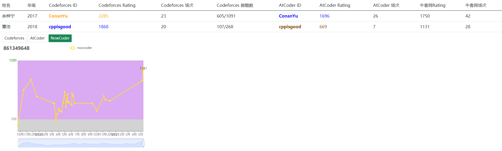

# FriendRatingServer

## 已经实现的功能

- 在网页中查看friends的各个Online Judge的情况

|OnlineJudge|比赛情况|做题情况|
|----|----|----|
|CodeForces|√|√|
|AtCoder|√| |
|牛客网|√| |
|洛谷| |√|

- 点击Rating列的表头可以进行排序

- 一个管理friends的网页

## 未来会实现的功能

- 更多OJ支持

## 部署

本项目Web端基于Django开发，前端基于Vue、Bootstrap、ECharts开发。

### Python3安装

### 相关库安装

`pip install -r requirements.txt`

### 运行

Windows下直接打开run_server.bat即可。

Linux下手动将run_server.sh中的python改成python3后，调用`sh run_server.sh`即可。
